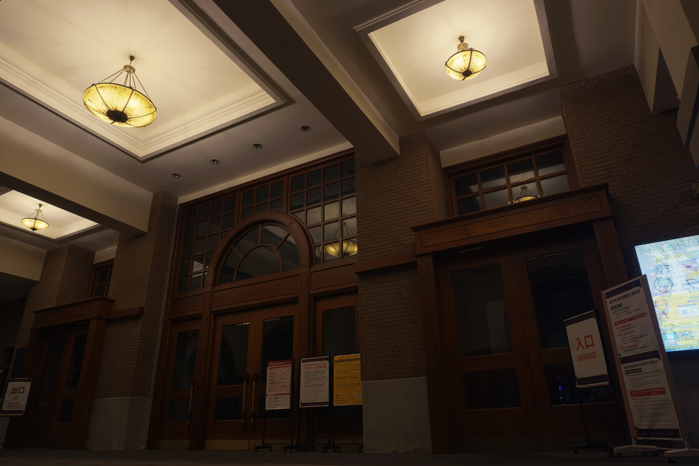
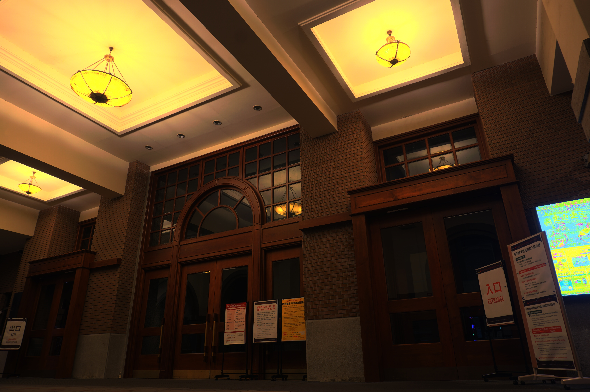
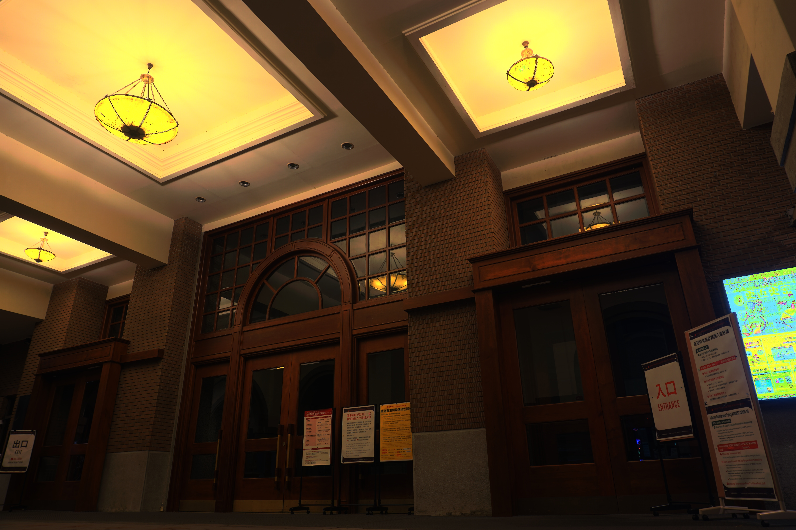
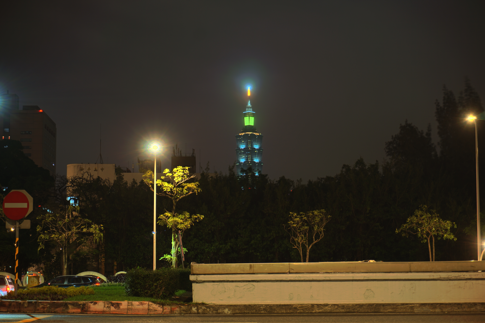
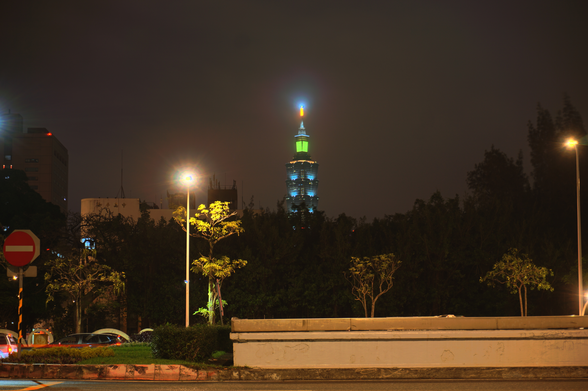
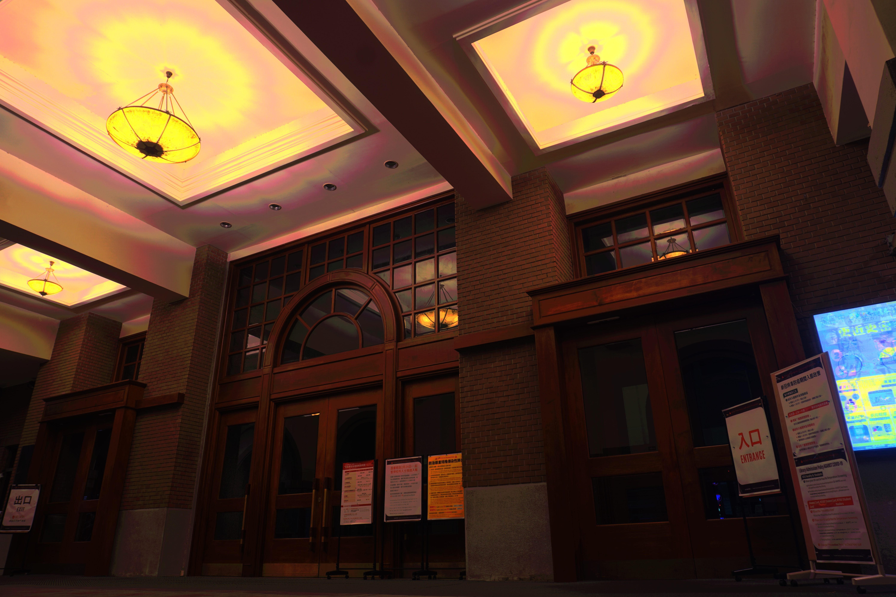
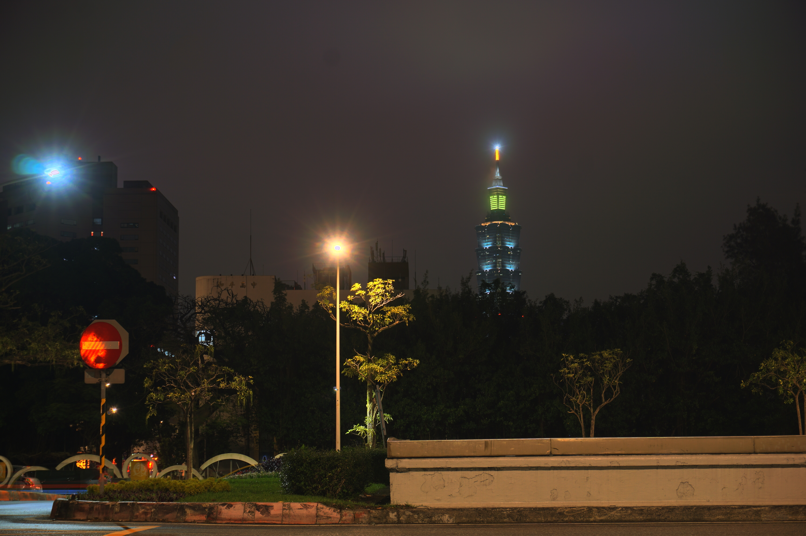

<h2></h2>
<div align="right">姓名：陳力宇&nbsp;&nbsp;&nbsp;&nbsp;學號：R08922069</div>
<h1 align="center">Project 1</h1>

## Recovering High Dynamic Range Radiance Maps from Photographs

**實作內容：**

1. **MTB alignment** (bonus)
   實作課堂提到的 MTB 來對齊圖片，以曝光時間作為排序，將所有照片對中間的那張照片對齊。
   由於 bitmap 過小時可能會全部空白，導致各個方向誤差皆為 0，這邊只對照片做最多 5 bits shift，也就是最多 shift 32 pixels
2. **HDR radiance map**
   實作課堂提到的 Paul Debevec's method，使用 Armadillo library 計算 SVD
3. **Ghost removal**
   在建立 radiance map 的過程中，在同一個 pixel 中每張照片回推的能量值，將與中位數差異過大的排除。
4. **Tone mapping** (bonus)
   實作課堂提到 Reinhard 的 global 和 local 兩種方法，還有使用 contrast 的方法。
   總共三種 tone mapping 的方式。

---

**使用方法：**

將照片放在同一個資料夾中，並建立 image_list.txt，每行分別記錄一組：image filename 和 1 / exposure time (曝光時間倒數)

```
DSC00721.JPG 8
DSC00722.JPG 4
DSC00723.JPG 2
DSC00724.JPG 1
...
```

接著編譯及執行，指定照片資料夾的路徑

```bash
$ cd HDR/
$ make
$ ./hdr image_dir/ [optional arguments]
```

Optional arguments:

- --skip-alignment: 不做 MTB alignment
- --global-tone: 使用 Reinhard global operator
- --blend-tone: 使用 Reinhard global operator * 0.5 + local operator * 0.5
- --contrast-tone: 使用 contrast tone mapping
- --remove-ghost: 去除鬼影

預設的 tone mapping 方式為 Reinhard local operator

程式會產生 radiance map (radiance_map.hdr) 及 tone-mapping 的結果 (tone.jpg) 在照片的同一個目錄中。

**開發環境：**

g++ version 9.2.1 on WSL Ubuntu

**Library:**

1. [OpenCV](https://opencv.org)
2. [Armadillo](http://arma.sourceforge.net/)

---

**Result:**

使用相機：SONY ILCE-6000
手動模式，固定 F-stop f/8, ISO 100，調整快門時間

- contrast tone mapping



-  Reinhard global operator tone mapping



-  Reinhard local operator tone mapping



---

- shadow removal (可比較左下角位置的車燈殘影)





---

- shadow removal (可比較樹葉的殘影)


---

**Problem:**

-  Reinhard global operator tone mapping (天花板的顏色有問題)



- 部分 tone mapping 的結果有過曝的光點



---

結果的原圖在 result 資料夾內。
不同曝光時間的照片在 images 資料夾內。
